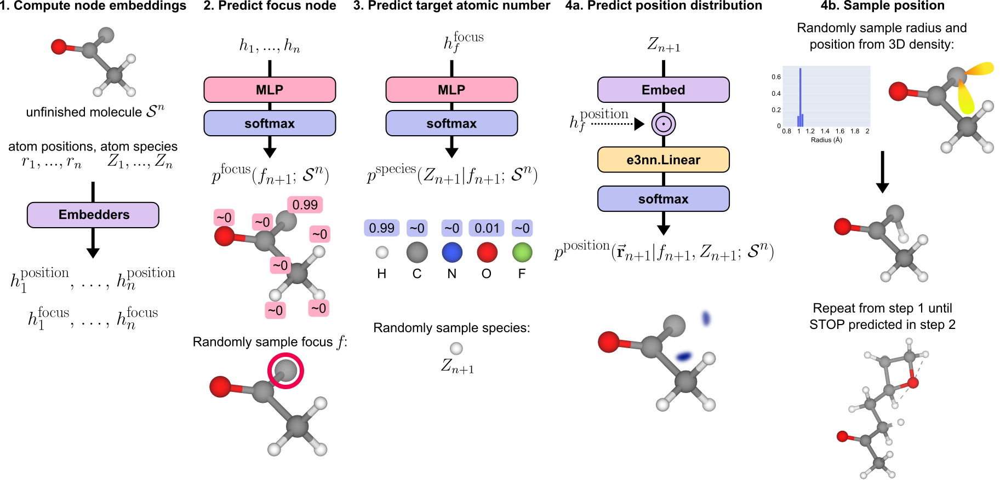

## Symphony: Symmetry-Equivariant Point-Centered Spherical Harmonics for Molecule Generation



This is the official code-release for the paper [Symphony: Symmetry-Equivariant Point-Centered Spherical Harmonics for Molecule Generation](https://openreview.net/forum?id=MIEnYtlGyv), published at ICLR 2024.

### Instructions

Clone the repository:

```shell
git clone git@github.com:atomicarchitects/symphony.git
cd symphony
git checkout iclr_2024_final
```

Since this repository is actively being developed, we recommend using the `iclr_2024_final` branch for the most stable version of the code.

#### Default Setup
Create and activate a virtual environment:

```shell
python -m venv .venv && source .venv/bin/activate
```

Install pip dependencies with:

```shell
pip install --upgrade pip && pip install -r requirements.txt
```

Running the analysis script requires `openbabel==3.1.1`. This can be installed through conda.


#### Checking Installation
Check that installation suceeded by running a short test:

```shell
python -m tests.train_test
```

#### Start a Training Run 
Start training with a configuration defined
under `configs/`:

```shell
python -m symphony \
    --config configs/qm9/e3schnet_and_nequip.py \
    --workdir ./workdirs
```

The `--workdir` flag specifies the directory where the
model checkpoints, logs, and other artifacts will be saved.

#### Changing Hyperparameters

Since the configuration is defined using
[config_flags](https://github.com/google/ml_collections/tree/master#config-flags),
you can override hyperparameters.
For example, to change the number of training
steps, and the batch size:

```shell
python -m symphony --config configs/qm9/e3schnet_and_nequip.py \
    --workdir ./workdirs \
    --config.num_train_steps=10 --config.max_n_graphs=16
```

For more extensive changes, directly edit the configuration files,
or add your own.


## Citation

Please cite our paper if you use this code!

```bibtex
@inproceedings{
    daigavane2024symphony,
    title={Symphony: Symmetry-Equivariant Point-Centered Spherical Harmonics for Molecule Generation},
    author={Ameya Daigavane and Song Eun Kim and Mario Geiger and Tess Smidt},
    booktitle={The Twelfth International Conference on Learning Representations},
    year={2024},
    url={https://openreview.net/forum?id=MIEnYtlGyv}
}
```
